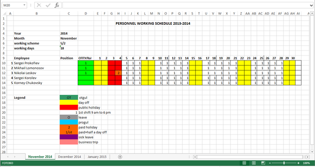

# timesheet-xls-parser

Automatization of parsing XLS-files with timesheet information.
Organization has such files with many worksheets for each team. The issue is to start use application for storing this information in comfortable format.

The data need to be moved into database of [https://github.com/patgod85/timesheet](https://github.com/patgod85/timesheet)

Example of workbook:

